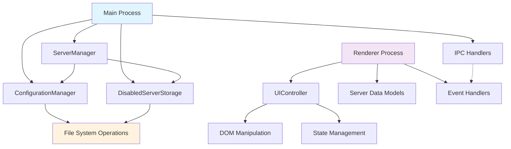

# Design Document

## Overview

The MCP Server Manager is a macOS-native Electron desktop application that provides a simple graphical interface for managing MCP (Model Context Protocol) servers used by Claude Code and Claude Desktop applications. The design converts the existing Python Streamlit prototype into a lightweight desktop tool while maintaining the core business logic patterns and data management approach.

The application follows a single-window, tab-based interface design with clear separation between main process (file operations, configuration management) and renderer process (UI, user interactions). The architecture emphasizes simplicity, reliability, and atomic file operations to ensure configuration integrity.

## Steering Document Alignment

### Technical Standards (tech.md)
No specific steering documents exist for this project. The design follows Electron best practices with secure IPC communication, context isolation, and atomic file operations.

### Project Structure (structure.md)
The project follows a clean modular structure separating main process logic from renderer logic with clear responsibilities for each module.

## Code Reuse Analysis

The design leverages proven patterns from the existing Python implementation, adapting them to JavaScript/Node.js:

### Existing Components to Leverage
- **ConfigurationManager Pattern**: Adapted from Python `config/manager.py` for centralized configuration management
- **DisabledServerStorage Pattern**: Adapted from Python `config/storage.py` for managing disabled server state
- **Atomic File Operations**: Adapted from Python `utils/file_ops.py` using temporary files and atomic renames
- **Server Data Models**: Adapted the server representation and project context preservation logic

### Integration Points
- **macOS File System**: Integration with `~/.claude.json`, `~/Library/Application Support/Claude/` paths
- **Shell Integration**: System default application opening for configuration file editing
- **IPC Communication**: Secure communication between main and renderer processes

## Architecture

The application follows Electron's recommended two-process architecture with secure communication:

### Modular Design Principles
- **Single Process Responsibility**: Main process handles file I/O and system operations, renderer handles UI
- **Component Isolation**: Configuration management, server operations, and UI components are isolated
- **Service Layer Separation**: Clear separation between data access, business logic, and presentation
- **Security Isolation**: Renderer process runs with context isolation and disabled node integration



## Components and Interfaces

### ConfigurationManager (Main Process)
- **Purpose:** Centralized configuration file management for both Claude Code and Claude Desktop
- **Interfaces:** 
  - `getClaudeCodeConfig()` → Promise\<Config\>
  - `getClaudeDesktopConfig()` → Promise\<Config\>
  - `saveConfig(path, data)` → Promise\<void\>
  - `createBackup(path)` → Promise\<boolean\>
- **Dependencies:** Node.js fs, path, os modules
- **Reuses:** Python ConfigurationManager patterns, atomic write operations

### ServerManager (Main Process)
- **Purpose:** Business logic for server discovery, enabling, and disabling operations
- **Interfaces:**
  - `getAllServers()` → Promise\<Server[]\>
  - `toggleServer(name, app, projectPath, enable)` → Promise\<void\>
  - `isServerEnabled(name, app, projectPath)` → Promise\<boolean\>
- **Dependencies:** ConfigurationManager, DisabledServerStorage
- **Reuses:** Python server management logic, project context preservation

### DisabledServerStorage (Main Process)
- **Purpose:** Manages storage and retrieval of disabled server configurations
- **Interfaces:**
  - `addDisabledServer(app, name, config, projectPath)` → Promise\<void\>
  - `removeDisabledServer(app, name, projectPath)` → Promise\<ServerConfig\>
  - `getDisabledServers(app)` → Promise\<ServerConfig[]\>
- **Dependencies:** Node.js fs module, JSON operations
- **Reuses:** Python disabled storage patterns with atomic operations

### UIController (Renderer Process)  
- **Purpose:** Manages the user interface state, rendering, and user interactions
- **Interfaces:**
  - `init()` → void (initialization and event binding)
  - `render()` → void (DOM updates)
  - `switchTab(tab)` → void (tab navigation)
  - `refreshData()` → Promise\<void\>
- **Dependencies:** DOM APIs, electronAPI bridge
- **Reuses:** Server display patterns from Python Streamlit UI

### Server Data Model (Renderer Process)
- **Purpose:** Client-side representation of MCP server with display formatting
- **Interfaces:**
  - `constructor(serverData)` → Server
  - `getDisplayCommand()` → string
  - `detectType()` → 'python'|'nodejs'|'binary'
  - `maskSensitiveEnvVars()` → object
- **Dependencies:** None (pure data model)
- **Reuses:** Server detection and formatting logic from Python implementation

## Data Models

### ConfigurationFile
```typescript
interface ConfigurationFile {
  mcpServers: Record<string, ServerConfig>
  projects?: Record<string, ProjectConfig>
}

interface ProjectConfig {
  mcpServers: Record<string, ServerConfig>
}
```

### ServerConfig
```typescript
interface ServerConfig {
  command: string
  args: string[]
  env?: Record<string, string>
  cwd?: string
}
```

### Server (Display Model)
```typescript
interface Server {
  name: string
  config: ServerConfig
  enabled: boolean
  scope: 'global' | 'project'
  app: 'claude-code' | 'claude-desktop'
  projectPath?: string
  projectName?: string
  type: 'python' | 'nodejs' | 'binary'
}
```

### DisabledServerEntry
```typescript
interface DisabledServerEntry {
  name: string
  config: ServerConfig
  disabledAt: string // ISO timestamp
  originalApp: 'claude-code' | 'claude-desktop'
  projectPath?: string
  projectName?: string
}
```

## Error Handling

### Error Scenarios
1. **File Access Errors:** Missing, corrupted, or permission-denied configuration files
   - **Handling:** Graceful degradation with empty configuration assumption
   - **User Impact:** Alert dialog with descriptive message, ability to continue with limited functionality

2. **JSON Parse Errors:** Malformed configuration files
   - **Handling:** Backup current file, attempt to create valid empty configuration
   - **User Impact:** Alert dialog explaining corruption, option to restore from backup

3. **Atomic Write Failures:** Disk space, permissions, or concurrent access issues
   - **Handling:** Rollback operations, preserve original state, retry mechanism
   - **User Impact:** Alert dialog with specific error, no data loss

4. **Server Toggle Failures:** Configuration write fails during enable/disable
   - **Handling:** Restore disabled server state, rollback configuration changes
   - **User Impact:** Alert dialog explaining failure, server remains in previous state

5. **Project Path Resolution:** Invalid or inaccessible project directories
   - **Handling:** Display warning but maintain server configuration, resolve ~ paths
   - **User Impact:** Visual indicator of path issues, server still manageable

## Implementation Architecture Details

### Main Process Structure
```javascript
// src/main/config-manager.js
class ConfigurationManager {
  async getClaudeCodeConfig() { /* File read with error handling */ }
  async saveConfig(path, data) { /* Atomic write with backup */ }
  async createBackup(path) { /* Daily backup creation */ }
}

// src/main/server-manager.js  
class ServerManager {
  async getAllServers() { /* Discover from both apps */ }
  async toggleServer(name, app, projectPath, enable) { /* Enable/disable logic */ }
}

// src/main/disabled-storage.js
class DisabledServerStorage {
  async addDisabledServer(app, name, config, projectPath) { /* Store with metadata */ }
  async removeDisabledServer(app, name, projectPath) { /* Retrieve and remove */ }
}
```

### IPC Communication Layer
```javascript
// src/main/ipc-handlers.js
ipcMain.handle('get-all-servers', async () => {
  return await serverManager.getAllServers();
});

ipcMain.handle('toggle-server', async (event, name, app, projectPath, enable) => {
  return await serverManager.toggleServer(name, app, projectPath, enable);
});

ipcMain.handle('open-config-file', async (event, app) => {
  const path = configManager.getConfigPath(app);
  return await shell.openPath(path);
});
```

### Renderer Process Structure
```javascript
// src/renderer/ui-controller.js
class UIController {
  constructor() {
    this.servers = [];
    this.currentTab = 'claude-code';
  }
  
  async init() {
    this.setupEventListeners();
    await this.loadServers();
    this.render();
  }
  
  async toggleServer(serverName, app, projectPath) {
    const currentlyEnabled = this.isServerEnabled(serverName);
    await window.electronAPI.toggleServer(serverName, app, projectPath, !currentlyEnabled);
    await this.refreshData();
  }
}
```

### File System Operations
```javascript
// Atomic write implementation
async function atomicWrite(filePath, data) {
  const tempPath = `${filePath}.tmp`;
  await fs.writeFile(tempPath, JSON.stringify(data, null, 2), 'utf8');
  await fs.rename(tempPath, filePath);
}

// Backup system
async function createDailyBackup(originalPath) {
  const today = new Date().toISOString().split('T')[0];
  const backupPath = `${originalPath}.backup.${today}`;
  
  if (await fs.pathExists(backupPath)) {
    return true; // Already backed up today
  }
  
  await fs.copy(originalPath, backupPath);
  return true;
}
```

### Security Context Bridge
```javascript
// src/renderer/preload.js
const { contextBridge, ipcRenderer } = require('electron');

contextBridge.exposeInMainWorld('electronAPI', {
  getAllServers: () => ipcRenderer.invoke('get-all-servers'),
  toggleServer: (name, app, projectPath, enable) => 
    ipcRenderer.invoke('toggle-server', name, app, projectPath, enable),
  openConfigFile: (app) => ipcRenderer.invoke('open-config-file', app),
  refreshData: () => ipcRenderer.invoke('refresh-data')
});
```

### Project Structure
```
src/
├── main/
│   ├── config-manager.js      # Configuration file operations
│   ├── server-manager.js      # Business logic for server operations  
│   ├── disabled-storage.js    # Disabled server storage management
│   └── ipc-handlers.js        # IPC communication setup
├── renderer/
│   ├── index.html            # Main application window
│   ├── preload.js            # Secure context bridge
│   ├── renderer.js           # UI controller and event handling
│   ├── server-model.js       # Client-side server data model
│   └── styles.css            # Application styling
└── main.js                   # Electron main process entry point
```

### Basic UI Component Structure

The UI follows a simple tab-based layout with server cards:

```html
<!-- Tab Navigation -->
<nav class="tabs">
  <button class="tab-button active" data-tab="claude-code">Claude Code</button>
  <button class="tab-button" data-tab="claude-desktop">Claude Desktop</button>
</nav>

<!-- Statistics Display -->
<div class="stats-container">
  <div class="stat-item">
    <span class="stat-label">Active:</span>
    <span class="stat-value" id="active-count">0</span>
  </div>
  <div class="stat-item">
    <span class="stat-label">Disabled:</span>
    <span class="stat-value" id="disabled-count">0</span>
  </div>
</div>

<!-- Server Cards Container -->
<div class="servers-container" id="servers-list">
  <!-- Server cards populated dynamically -->
</div>
```

### UI Styling

The application uses standard web technologies with semantic styling:

```css
/* Basic layout and structure */
body {
  font-family: system-ui, -apple-system, sans-serif;
  margin: 0;
  padding: 0;
}

/* Server card styling */
.server-card {
  border: 1px solid;
  border-radius: 4px;
  padding: 16px;
  margin: 8px 0;
}

.server-card.disabled {
  opacity: 0.6;
}

/* Status indicators */
.status-active { /* enabled server styling */ }
.status-disabled { /* disabled server styling */ }
.status-error { /* error state styling */ }

/* Interactive elements */
button {
  cursor: pointer;
  padding: 8px 16px;
  border: 1px solid;
  border-radius: 4px;
}

button:hover {
  opacity: 0.8;
}

/* Layout components */
.tabs {
  display: flex;
}

.tab-button {
  flex: 1;
}

.tab-button.active {
  font-weight: bold;
}

.stats-container,
.config-info,
.servers-container {
  margin: 16px 0;
  padding: 16px;
}
```

This design document provides comprehensive guidance for implementing a reliable, secure, and maintainable Electron application that faithfully converts the Python MCP Server Manager prototype while following modern desktop application best practices.